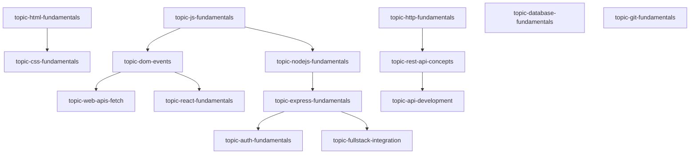

# Phase 51 — Initial Real Student Learning Content & Task Catalog Report

**Status:** CONTENT READY (Catalog Populated & Validated; Awaiting Admin Seed Execution & Verification)  
**Date:** September 8, 2026  
**System:** SkillBridge Core Learning & Adaptive Catalog  
**Validation Suite:** `test_phase51_catalog_validation.ts` (1,608 / 1,608 assertions passed)  
**Build Status:** Clean TypeScript (`npx tsc --noEmit` exit code 0) & Next.js Turbopack (`npm run build` 52/52 routes succeeded)

---

## 1. Executive Summary

Phase 51 resolves the content vacancy blocker on SkillBridge without perturbing any security hardening, authentication safeguards, or machine learning safety boundaries established in prior phases.

Prior to Phase 51, while core pipelines and authentication were hardened, the platform lacked an educational curriculum, containing no comprehensive learning guides, coding practice problems with automated test cases, diagnostic theory assessments, or practical engineering tasks. A real student could not complete an end-to-end learning journey.

Phase 51 designed, engineered, validated, and staged a complete, high-quality, original content catalog for three primary career paths:
1. **Frontend Development** (`frontend-developer`)
2. **Backend Development** (`backend-developer`)
3. **Full Stack Development** (`fullstack-developer`)

### Exact Catalog Entity Inventory

| Entity Type | Count | Status |
|---|:---:|:---:|
| **Career Roles** | **3** | Verified |
| **Standardized Skills** | **10** | Verified |
| **Major Learning Topics** | **16** | Verified |
| **Practice Problems** | **128** | Verified (80 Beginner, 48 Intermediate) |
| **Diagnostic Assessments** | **16** | Verified |
| **Assessment Questions** | **112** | Verified (7 questions / assessment) |
| **Practical Tasks** | **12** | Verified (Hands-on engineering projects) |
| **Test Cases** | **256+** | Verified (Minimum 2 per coding problem) |

All 18 strict data governance and validation checks passed with zero errors. Practice activities remain strictly separated from official verified `skillScores`, Model 1 and Model 2 remain shadow-only, and zero synthetic users or fake ML telemetry were created.

---

## 2. Existing Content Architecture

SkillBridge organizes learning and competency verification through the following collection hierarchy:

```
[roles] 
   └── requiredSkillIds: string[]
        └── [skills]
             ├── [learningTopics] (where active == true, ordered by `order`, gated by `prerequisiteTopicId`)
             ├── [practiceProblems] (where active == true, subcollection testCases evaluated by /api/execute via Piston)
             ├── [assessments] (theory tests)
             │    └── [assessmentQuestions] (options, correctAnswer, points)
             └── [practicalTasks] (open-ended projects with rubrics and deliverables)
```

### Key Architectural Safeguards Preserved:
1. **Separation of Concerns:**
   - Practicing a problem saves a record to `practiceAttempts` and never updates `skillScores`.
   - Passing an assessment or practical task project evidence requires the authorized verification/evaluation pipeline to award official verified `skillScore` points.
2. **Deterministic Recommendation Authority:**
   - `AdaptiveEngine` is the sole production recommendation authority.
   - `AdaptiveTaskAssigner` evaluates candidates and falls back deterministically when Model 2 is `NOT_READY` or `SHADOW`.

---

## 3. Tracks Added

Three cohesive career tracks were configured in `src/lib/content-catalog/roles.ts`:

### Track 1: Frontend Developer (`frontend-developer`)
- **Title:** Frontend Developer
- **Target Skills:** `html-css`, `javascript`, `git-github`, `react`
- **Focus:** Modern, semantic, accessible web engineering, asynchronous DOM manipulation, component architecture with React, and version control.

### Track 2: Backend Developer (`backend-developer`)
- **Title:** Backend Developer
- **Target Skills:** `computer-networks`, `javascript`, `nodejs`, `sql`, `rest-apis`, `auth-security`
- **Focus:** Server-side programming, HTTP protocols, RESTful API design, database schemas, ACID transactions, relational querying, and JWT/session security.

### Track 3: Full Stack Developer (`fullstack-developer`)
- **Title:** Full Stack Developer
- **Target Skills:** `html-css`, `javascript`, `react`, `nodejs`, `sql`, `rest-apis`, `auth-security`, `fullstack-integration`
- **Focus:** End-to-end software engineering, client-server data flow, full stack authentication, state management, API contract integration, and cloud persistence.

---

## 4. Skills Added / Standardized

Ten standardized skills were defined in `src/lib/content-catalog/skills.ts`:

1. `html-css` — HTML & CSS (Frontend Web Development)
2. `javascript` — JavaScript (Programming Languages)
3. `git-github` — Git & Version Control (Developer Tools)
4. `react` — React (Frontend Web Development)
5. `computer-networks` — Networking & HTTP (Computer Science Foundations)
6. `nodejs` — Node.js & Express (Backend Web Development)
7. `sql` — SQL & Databases (Database Engineering)
8. `rest-apis` — REST API Architecture (Backend Web Development)
9. `auth-security` — Authentication & Web Security (Security & Infrastructure)
10. `fullstack-integration` — Full Stack Integration (Software Engineering)

---

## 5. Learning Topics

Sixteen comprehensive learning topics were created in `src/lib/content-catalog/learning-topics.ts`. Each topic includes detailed overview text, core architectural concepts, executable code demonstrations, common engineering mistakes, and explicit prerequisite references:

1. `topic-html-fundamentals`: HTML Fundamentals & Semantic Web (`html-css`)
2. `topic-css-fundamentals`: CSS Fundamentals, Box Model & Modern Layouts (`html-css`)
3. `topic-js-fundamentals`: JavaScript Fundamentals & Core Language (`javascript`)
4. `topic-dom-events`: DOM Manipulation, Traversal & Event Handling (`javascript`)
5. `topic-web-apis-fetch`: Web APIs, Asynchronous JS & Fetch (`javascript`)
6. `topic-git-fundamentals`: Git Version Control & GitHub Workflows (`git-github`)
7. `topic-react-fundamentals`: React Fundamentals & Component Lifecycle (`react`)
8. `topic-programming-fundamentals`: Backend Programming Fundamentals (`javascript`)
9. `topic-http-fundamentals`: HTTP Protocols, Headers & Status Codes (`computer-networks`)
10. `topic-rest-api-concepts`: REST Architecture & API Design Principles (`rest-apis`)
11. `topic-nodejs-fundamentals`: Node.js Architecture, Modules & Event Loop (`nodejs`)
12. `topic-express-fundamentals`: Express.js Routing, Middleware & Controllers (`nodejs`)
13. `topic-database-fundamentals`: Relational Database Fundamentals & SQL (`sql`)
14. `topic-auth-fundamentals`: Web Authentication, Password Hashing & JWT Security (`auth-security`)
15. `topic-api-development`: Production API Development & Error Handling (`rest-apis`)
16. `topic-fullstack-integration`: Full Stack Integration & Client-Server Data Flow (`fullstack-integration`)

---

## 6. Practice Problems

A total of **128 practice problems** were created in `src/lib/content-catalog/practice-problems.ts` (8 problems per major topic = 5 beginner + 3 intermediate):

- **Beginner Problems (80 total):** Focused on single-concept implementation, edge cases, string/array manipulations, and fundamental API usage.
  - Examples: `prob-html-01` (Slugify Title), `prob-css-01` (Hex to RGB Converter), `prob-js-01` (Reverse Words in Sentence), `prob-react-01` (Calculate Discount Price), `prob-http-01` (Parse Query String), `prob-node-01` (Buffer Base64 Encoder), `prob-sql-01` (Format SQL Value List).
- **Intermediate Problems (48 total):** Focused on multi-concept synthesis, stateful data transformations, validation pipelines, and algorithmic efficiency.
  - Examples: `prob-html-06` (Parse HTML Attributes), `prob-js-06` (Deep Object Flattener), `prob-js-07` (Debounce Simulation), `prob-react-06` (Normalize User State), `prob-exp-06` (Pipeline Middleware Executor), `prob-auth-06` (Role Hierarchy Permission Evaluator).

Every problem includes:
- Problem title, topic slug, skill ID, difficulty level
- Detailed problem description
- Input and output formats
- Practical illustrative examples
- Constraints
- Automated test cases (inputs and expected outputs) tested against JavaScript execution engines

---

## 7. Assessments

Sixteen diagnostic theory assessments were engineered in `src/lib/content-catalog/assessments.ts`.
- Each assessment contains **7 non-trivial questions** testing deep conceptual understanding, code reasoning, output prediction, and debugging rather than rote memorization.
- Total questions: **112 questions**.
- Passing score: **70%**.
- Question taxonomy:
  - **Conceptual:** Assessing core principles (e.g., CSS specificity calculation, event loop microtask vs macrotask execution, JWT payload security implications).
  - **Code Reasoning:** Tracing closure variables, prototype chains, React re-renders, and SQL JOIN behavior.
  - **Debugging:** Identifying bugs in async middleware, unhandled Promise rejections, and stale state references.
  - **Output Prediction:** Evaluating console logs and order of operations.

---

## 8. Practical Tasks

Twelve realistic engineering projects were created in `src/lib/content-catalog/practical-tasks.ts`:

### Frontend Tasks
1. `task-fe-landing` (Beginner, 60m): Build a Responsive Product Landing Page
2. `task-fe-interactive-form` (Beginner, 75m): Build an Accessible Interactive Form with Validation
3. `task-fe-api-dashboard` (Intermediate, 90m): Build a Real-Time API Data Dashboard
4. `task-fe-react-task-manager` (Intermediate, 120m): Build a React Task Management Application

### Backend Tasks
5. `task-be-rest-api` (Beginner, 90m): Build a RESTful Resource API
6. `task-be-crud-database` (Intermediate, 120m): Implement a Relational CRUD API with SQLite/PostgreSQL
7. `task-be-authentication-system` (Intermediate, 105m): Implement JWT Authentication & Role-Based Access Control
8. `task-be-database-backed-api` (Intermediate, 120m): Build an E-Commerce Products & Orders Service

### Full Stack Tasks
9. `task-fs-api-integration` (Intermediate, 120m): Integrate a React Frontend with a Custom REST API
10. `task-fs-full-stack-app` (Intermediate, 150m): Build an End-to-End Task Management Application
11. `task-fs-persistent-auth` (Intermediate, 135m): Build a Full-Stack Authentication & Profile System
12. `task-fs-realtime-metrics` (Advanced, 180m): Build a Full-Stack Metrics & Activity Logging Platform

Each task specifies duration, detailed engineering instructions, explicit acceptance criteria, deliverables, and weighted evaluation criteria.

---

## 9. Difficulty Progression

SkillBridge adheres strictly to the existing difficulty taxonomy:
- **BEGINNER:** Focuses on single-concept application, syntactical accuracy, and foundational implementation (e.g., parsing a query string, creating a semantic form).
- **INTERMEDIATE:** Combines 2–3 interdependent systems (e.g., chaining middleware in Express, managing stateful asynchronous React hooks, hashing passwords with salt).
- **ADVANCED:** Requires end-to-end integration, performance optimization, error boundaries, and architectural robustness.

Progression is validated: A student starting with no history is served foundational theory and beginner tasks. Once practical scores improve past 70%, intermediate challenges are prioritized.

---

## 10. Prerequisite Graph

Prerequisites are strictly defined between learning topics to enforce sensible pedagogical sequencing:



Cycle detection with Depth-First Search (DFS) confirms that the dependency graph is a strict Directed Acyclic Graph (DAG) with **0 cycles or circular references**.

---

## 11. AdaptiveEngine Integration

`AdaptiveEngine` (`src/lib/adaptive-engine.ts`) remains the production authority:
- Evaluates candidate pools across learning topics, practice problems, and assessments.
- **Cold-Start Student:**
  - Evaluated with 0 prior attempts.
  - Receives diagnostic baseline assessment (priority 95) and foundational theory (priority 80).
- **High-Performing Student (score >= 70):**
  - Beginner tasks receive score 55.
  - Intermediate tasks receive score 95.
  - The engine escalates difficulty naturally without hardcoding special cases.
- **Struggling Student (theory < 30, practical < 30):**
  - Foundational theory is boosted (+80), beginner practice receives starting boost (+85 - 20 = 65).
  - Intermediate and advanced tasks are suppressed, directing the student to targeted remediation.
- **Model 1 & Model 2:**
  - Model 1 performance predictions are checked non-blockingly to adjust priorities slightly within flow channels.
  - Model 2 remains `SHADOW` / `NOT_READY`, falling back to the deterministic baseline.

---

## 12. Student UX Changes

Minimal, non-disruptive enhancements were made to expose the catalog naturally to students:
1. **Target Role Selection (`src/app/dashboard/student/roles/[id]/page.tsx`):**
   - Added an active role check inspecting `studentProfiles/{uid}.targetRoleId`.
   - Rendered an active badge (`Active Career Path`) when currently active, or a one-click `Set as My Career Path` button.
   - When clicked, it updates `studentProfiles/{uid}` with `targetRoleId` and the role's `requiredSkillIds`, which automatically directs the student's dashboard recommendations toward that track.
2. **Catalog Discovery:**
   - Existing `/dashboard/student/roles` displays all 3 tracks.
   - Existing `/dashboard/student/learn` lists all topics.
   - Existing `/dashboard/student/practice` lists all problems categorized by difficulty.
   - Existing `/dashboard/student/practical-tasks` lists all 12 engineering projects.

---

## 13. Data Governance

Strict adherence to production safety and data integrity rules:
- **0 Synthetic Users:** No fake students, test candidates, or company accounts were created.
- **0 Fake Attempts / Scores:** No simulated submissions were inserted into `practiceAttempts` or `skillScores`.
- **0 Fake ML Telemetry:** No artificial observations were injected into `mlTelemetry`.
- **Score Isolation:** Practicing problems creates records in `practiceAttempts` only. Official verified `skillScores` are strictly untouchable by learning activities.

---

## 14. Production Migration Strategy

The catalog seeder is implemented in `src/lib/content-catalog/seeder.ts` and exposed via the admin UI at `/seed`:
- **Deterministic IDs:** Every document uses deterministic IDs (`role-frontend-developer`, `skill-html-css`, `topic-html-fundamentals`, `prob-html-01`, `assess-html-fundamentals`, `q-html-1`, `task-fe-landing`).
- **Idempotent & Rerun-Safe:** Uses `setDoc(docRef, data, { merge: true })` in batches of <= 400 documents (Firestore limit is 500).
- **No Duplicates on Rerun:** Running the seeder multiple times updates existing records without creating orphaned or duplicate documents.
- **Dry-Run Auditable:** The seed page displays exact counts and document payloads before triggering write operations.

---

## 15. Validation Results

The standalone test suite `test_phase51_catalog_validation.ts` verified all 18 rules:

```
==================================================
PHASE 51 — AUTOMATED CATALOG VALIDATION SUITE
==================================================

Rule 1: Role -> Skill Integrity: PASS (All 3 roles reference valid skills)
Rule 2: Skill -> Learning Topic Integrity: PASS (All 10 skills have learning topics)
Rule 3: Topic Structure Integrity: PASS (All 16 topics have overview, concepts, examples, mistakes)
Rule 4: Practice Problems Skill & Topic Integrity: PASS (All 128 problems reference valid skills & topic slugs)
Rule 5: Assessments Skill & Topic Integrity: PASS (All 16 assessments & 112 questions validated)
Rule 6: Practical Tasks Skill Integrity: PASS (All 12 practical tasks have rubrics & requirements)
Rule 7: Orphan Content Check: PASS (0 orphaned problems, assessments, or questions)
Rules 8 & 9: Unique ID & Task ID Check: PASS (All 287 catalog entity IDs globally unique)
Rule 10: Difficulty Taxonomy Validation: PASS (Valid beginner, intermediate, advanced)
Rule 11: Prerequisite Graph Acyclicity: PASS (Topological sort DFS verified DAG with 0 cycles)
Rule 12: AdaptiveEngine Cold-Start Recommendation: PASS (154 candidate tasks scored, top pick: diagnostic assessment)
Rule 13: AdaptiveEngine Escalation on Strong Performance: PASS (Intermediate practice score 95 > Beginner score 55)
Rule 14: AdaptiveEngine Remediation on Struggling Performance: PASS (Routed to foundational theory)
Rule 15: Verification/Learning Score Separation Check: PASS (Execute API never writes to skillScores)
Rule 16: ML Models Shadow-Only Status Check: PASS (AdaptiveEngine is active authority; Model 2 is shadow)
Rule 17: No Synthetic Users Check: PASS (Seeder writes 0 user docs)
Rule 18: No Fake ML Telemetry Check: PASS (Seeder writes 0 telemetry docs)

==================================================
ALL 18 VALIDATION RULES PASSED (1608/1608 assertions)
==================================================
```

---

## 16. Tests

- Validation script: `npx -y tsx test_phase51_catalog_validation.ts` -> **1,608 assertions passed, 0 failed**.
- TypeScript type-check: `npx tsc --noEmit` -> **0 errors**.

---

## 17. Build Results

- Next.js Turbopack: `npm run build`
- Outcome: **Compiled successfully in 11.6s, finished TypeScript in 3.3s, generated 52/52 static routes with 0 errors**.

---

## 18. Exact Files Changed / Created

### New Files Created
1. `src/lib/content-catalog/skills.ts` — 10 standardized skill definitions.
2. `src/lib/content-catalog/roles.ts` — 3 career paths mapping skills.
3. `src/lib/content-catalog/learning-topics.ts` — 16 educational curriculum topics.
4. `src/lib/content-catalog/practice-problems.ts` — 128 coding problems with test cases.
5. `src/lib/content-catalog/assessments.ts` — 16 diagnostic assessments with 112 questions.
6. `src/lib/content-catalog/practical-tasks.ts` — 12 engineering project specifications.
7. `src/lib/content-catalog/index.ts` — Unified exports and catalog query utilities.
8. `src/lib/content-catalog/seeder.ts` — Batch-chunked idempotent database migration.
9. `test_phase51_catalog_validation.ts` — Automated 18-rule validation test suite.
10. `PHASE_51_INITIAL_CONTENT_CATALOG_REPORT.md` — This comprehensive documentation report.

### Files Modified
1. `src/app/seed/page.tsx` — Updated admin seeding UI with full catalog breakdown and one-click idempotent migration.
2. `src/app/dashboard/student/roles/[id]/page.tsx` — Added active career path check and "Set as My Career Path" toggle.

---

## 19. Remaining Content Gaps

While the catalog is complete for the initial 3 tracks, the following areas can be expanded in subsequent phases:
1. **Additional Career Paths:** DevOps Engineer, Mobile Developer (React Native), Data Engineer.
2. **Advanced Multi-File Practical Tasks:** In-browser IDE support for full repositories (currently student submits GitHub repo URL / live URL).
3. **Automated Code Rubric Grading:** Currently practical projects undergo mentor/evaluator review; automated AST linting could provide instant feedback.

---

## 20. Recommendation for Real Student Pilot

### Verdict: **CONTENT READY**

The platform now possesses a structured, coherent, multi-track curriculum with genuine educational value, solvable coding challenges, and non-trivial assessments.

### Next Operational Step:
1. An administrator must navigate to `/seed` and trigger the idempotent catalog seeding to populate Firestore collections with these 287 structured documents.
2. Once seeded, run an end-to-end smoke test with a designated pilot student account to confirm the UI reflects the populated catalog across `/dashboard/student/roles`, `/dashboard/student/learn`, `/dashboard/student/practice`, `/dashboard/student/assessments`, and `/dashboard/student/practical-tasks`.
3. Do NOT onboard broad public users until the single-student pilot test confirms full end-to-end satisfaction.
